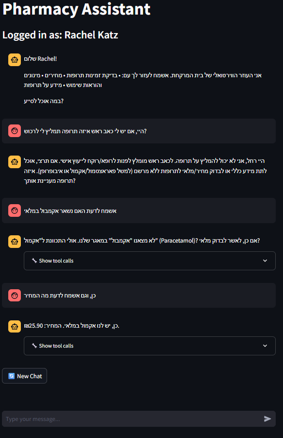
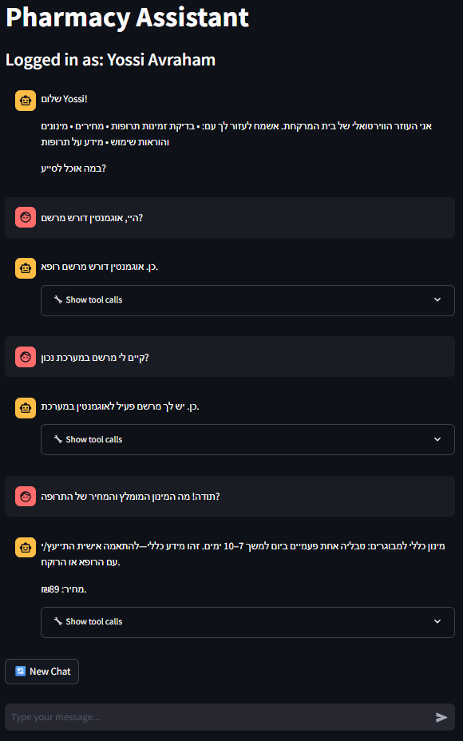

# Multi-Step Workflow Demonstrations

This document demonstrates three complex multi-step workflows where the pharmacy assistant agent uses multiple tools and policies to fulfill user requests in Hebrew.

---

## Workflow 1: No Medical Advice + Typo Handling

**User:** Rachel Katz (ID: 456789012)

**Scenario:** User asks for medication recommendation (which agent must refuse), then searches for "אקמבול" (typo), and finally gets information about "אקמול" (correct).

### Conversation Summary

1. User asks which medication to buy for headache
2. Agent refuses to recommend - redirects to doctor/pharmacist
3. User asks if "אקמבול" (typo) is in stock
4. Agent reports not found, suggests "אקמול" as correction
5. User confirms and asks for price
6. Agent provides availability and price

### Tools Called

#### Tool Call 1: Search for typo "אקמבול"
```json
Function: medication_exists
Arguments: {
  "medication_name": "אקמבול"
}
Result: {
  "found": false,
  "medication": null
}
```

#### Tool Call 2: Search for correct name "אקמול"
```json
Function: medication_exists
Arguments: {
  "medication_name": "אקמול"
}
Result: {
  "found": true,
  "medication": {
    "id": 1,
    "name_english": "Acamol",
    "name_hebrew": "אקמול"
  }
}
```

#### Tool Call 3: Get availability and price
```json
Function: get_medication_availability
Arguments: {
  "medication_id": 1
}
Result: {
  "found": true,
  "in_stock": true,
  "stock_quantity": 150,
  "price": 25.9
}
```

### Screenshot



---

## Workflow 2: Prescription Medication Access

**User:** Sarah Levi (ID: 234567890)

**Scenario:** User requests dosage information for Augmentin (prescription medication) but does **not** have a valid prescription in the system. Agent consistently denies access across multiple attempts.

### Conversation Summary

1. User asks for recommended dosage of Augmentin
2. Agent denies - no prescription found
3. User insists they have a prescription, asks to check again
4. Agent checks again - still no prescription
5. User asks for usage instructions instead
6. Agent refuses - consistent policy enforcement

### Tools Called

#### Tool Call 1: Check if medication exists (Query 1)
```json
Function: medication_exists
Arguments: {
  "medication_name": "אוגמנטין"
}
Result: {
  "found": true,
  "medication": {
    "id": 3,
    "name_english": "Augmentin",
    "name_hebrew": "אוגמנטין"
  }
}
```

#### Tool Call 2: Get medication profile - First attempt
```json
Function: get_medication_profile
Arguments: {
  "medication_id": 3
}
Result: {
  "found": true,
  "requires_prescription": true,
  "has_prescription": false,
  "can_access": false,
  "message": "This medication requires a prescription. You don't have an active prescription for this medication. Please consult your doctor."
}
```

#### Tool Call 3: Check if medication exists (Query 2 - re-check)
```json
Function: medication_exists
Arguments: {
  "medication_name": "אוגמנטין"
}
Result: {
  "found": true,
  "medication": {
    "id": 3,
    "name_english": "Augmentin",
    "name_hebrew": "אוגמנטין"
  }
}
```

#### Tool Call 4: Get medication profile - Second attempt
```json
Function: get_medication_profile
Arguments: {
  "medication_id": 3
}
Result: {
  "found": true,
  "requires_prescription": true,
  "has_prescription": false,
  "can_access": false,
  "message": "This medication requires a prescription. You don't have an active prescription for this medication. Please consult your doctor."
}
```

#### Tool Call 5: Get medication profile - Third attempt
```json
Function: get_medication_profile
Arguments: {
  "medication_id": 3
}
Result: {
  "found": true,
  "requires_prescription": true,
  "has_prescription": false,
  "can_access": false,
  "message": "This medication requires a prescription. You don't have an active prescription for this medication. Please consult your doctor."
}
```

#### Tool Call 6: Check if medication exists (Query 3)
```json
Function: medication_exists
Arguments: {
  "medication_name": "אוגמנטין"
}
Result: {
  "found": true,
  "medication": {
    "id": 3,
    "name_english": "Augmentin",
    "name_hebrew": "אוגמנטין"
  }
}
```

#### Tool Call 7: Get medication profile - Fourth attempt (usage instructions)
```json
Function: get_medication_profile
Arguments: {
  "medication_id": 3
}
Result: {
  "found": true,
  "requires_prescription": true,
  "has_prescription": false,
  "can_access": false,
  "message": "This medication requires a prescription. You don't have an active prescription for this medication. Please consult your doctor."
}
```

#### Tool Call 8: Get medication profile - Fifth attempt
```json
Function: get_medication_profile
Arguments: {
  "medication_id": 3
}
Result: {
  "found": true,
  "requires_prescription": true,
  "has_prescription": false,
  "can_access": false,
  "message": "This medication requires a prescription. You don't have an active prescription for this medication. Please consult your doctor."
}
```

### Screenshot


---

## Workflow 3: Prescription Medication Access Approval

**User:** Yossi Avraham (ID: 567890123)

**Scenario:** User requests information about Augmentin (prescription medication) and **has** a valid prescription in the system. Agent validates prescription and provides full information.

### Conversation Summary

1. User asks if Augmentin requires a prescription
2. Agent confirms it does
3. User asks if they have a prescription in the system
4. Agent confirms they do
5. User requests dosage and price information
6. Agent provides full information (prescription validated)

### Tools Called

#### Tool Call 1: Check if medication exists (Query 1)
```json
Function: medication_exists
Arguments: {
  "medication_name": "אוגמנטין"
}
Result: {
  "found": true,
  "medication": {
    "id": 3,
    "name_english": "Augmentin",
    "name_hebrew": "אוגמנטין"
  }
}
```

#### Tool Call 2: Get medication profile (Query 1)
```json
Function: get_medication_profile
Arguments: {
  "medication_id": 3
}
Result: {
  "found": true,
  "requires_prescription": true,
  "has_prescription": true,
  "can_access": true,
  "active_ingredients": "Amoxicillin 875mg + Clavulanic acid 125mg",
  "dosage_instructions": "Adults: 1 tablet twice daily for 7-10 days.",
  "usage_instructions": "Complete the full course even if symptoms improve. Take with food.",
  "factual_info": "Antibiotic for bacterial infections. Used for respiratory, urinary, and skin infections."
}
```

#### Tool Call 3: Check if medication exists (Query 3)
```json
Function: medication_exists
Arguments: {
  "medication_name": "אוגמנטין"
}
Result: {
  "found": true,
  "medication": {
    "id": 3,
    "name_english": "Augmentin",
    "name_hebrew": "אוגמנטין"
  }
}
```

#### Tool Call 4: Get medication profile (Query 3 - dosage)
```json
Function: get_medication_profile
Arguments: {
  "medication_id": 3
}
Result: {
  "found": true,
  "requires_prescription": true,
  "has_prescription": true,
  "can_access": true,
  "active_ingredients": "Amoxicillin 875mg + Clavulanic acid 125mg",
  "dosage_instructions": "Adults: 1 tablet twice daily for 7-10 days.",
  "usage_instructions": "Complete the full course even if symptoms improve. Take with food.",
  "factual_info": "Antibiotic for bacterial infections..."
}
```

#### Tool Call 5: Get availability and price (Query 3)
```json
Function: get_medication_availability
Arguments: {
  "medication_id": 3
}
Result: {
  "found": true,
  "in_stock": true,
  "stock_quantity": 45,
  "price": 89.0
}
```

#### Tool Call 6: Get medication profile again (Query 3)
```json
Function: get_medication_profile
Arguments: {
  "medication_id": 3
}
Result: {
  "found": true,
  "requires_prescription": true,
  "has_prescription": true,
  "can_access": true,
  "active_ingredients": "Amoxicillin 875mg + Clavulanic acid 125mg",
  "dosage_instructions": "Adults: 1 tablet twice daily for 7-10 days.",
  "usage_instructions": "Complete the full course even if symptoms improve. Take with food.",
  "factual_info": "Antibiotic for bacterial infections..."
}
```

### Screenshot




